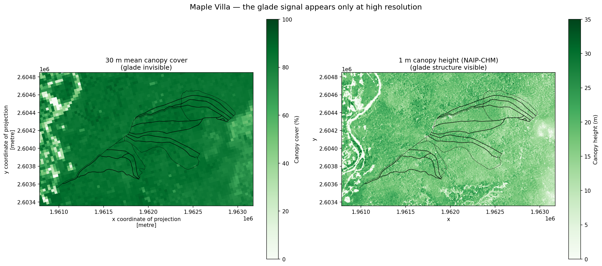
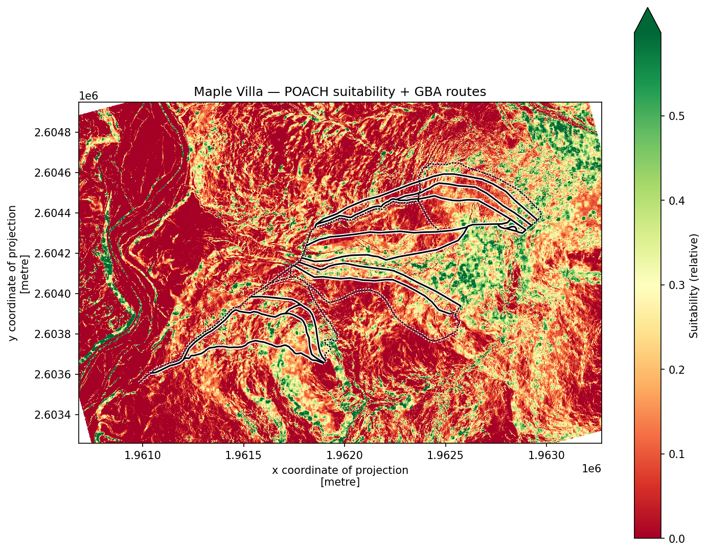
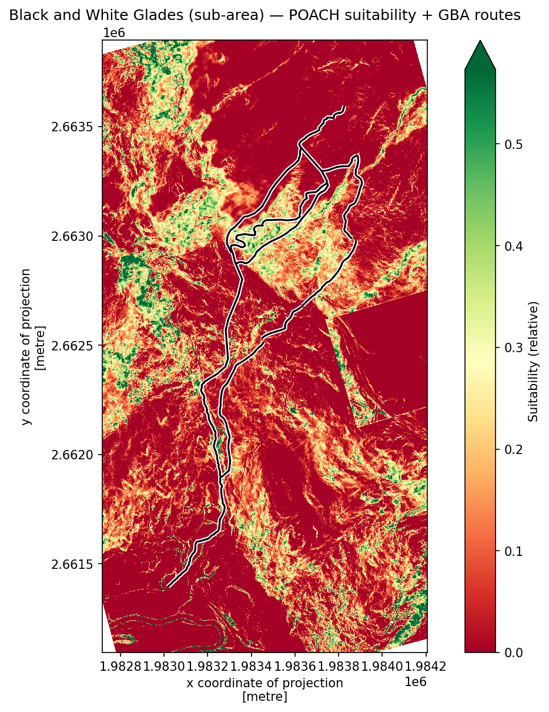

# POACH

**P**itch · **O**verstory · **A**spect · **C**ontinuity · **H**azard

POACH identifies candidate backcountry **glade skiing** terrain in the US
Northeast by combining high-resolution forest canopy structure with terrain
analysis, and validates its predictions against real glade routes mapped by the
[Granite Backcountry Alliance](https://granitebackcountryalliance.org/) (GBA).

> **Status:** Proof of concept. POACH demonstrates that glade structure is
> detectable in sub-meter canopy data, and honestly characterizes where a
> simple suitability model does and does not predict real glades.

## The core idea

A glade is not simply "forest" — it is forest *threaded with skiable gaps*:
mature overstory thinned by narrow, lower-canopy lanes. This structure is the
structure that makes tree skiing possible, and it is the structure POACH tries to detect.

Critically, that structure is **invisible in coarse canopy data**. At 30 m
resolution, a cut glade and the dense woods around it have nearly identical mean
canopy cover. At **1 m** resolution (NAIP-derived canopy height), the thinned
lanes become resolvable as local variability in canopy height. Demonstrating
this resolution dependence is the central finding of the project.



*At 30 m (left), the GBA routes sit on undifferentiated forest. At 1 m (right),
the thinned glade corridors become visible as canopy texture — the signal POACH
depends on.*

## How it works

POACH scores each factor from open geospatial data, normalizes to 0–1, and
combines them into a single suitability surface:

| Factor | Signal | Source |
| --- | --- | --- |
| **Pitch** | Slope steepness (skiable range) | USGS 3DEP DEM (1 m) |
| **Overstory** | Canopy gap structure (thinned forest) | NAIP-CHM canopy height (~1 m) |
| **Aspect** | Slope direction (snow retention) | USGS 3DEP DEM (1 m) |
| **Continuity** | *(planned)* connected skiable lines | — |
| **Hazard** | *(planned)* cliffs, terrain traps | — |

Pitch and Overstory act as **gates** (a glade needs both skiable slope and
forested gap structure); Aspect **modulates** snow quality. The combination is
deliberately conservative.

## Key results

**1. Glade structure is detectable at 1 m, invisible at 30 m.**
The strongest result. Local canopy-height variability at 1 m reveals thinned
glade corridors that mean canopy cover at 30 m cannot distinguish from
surrounding forest.

**2. Terrain + canopy suitability is a *weak* predictor of real glades.**
At the development zone (Maple Villa), GBA routes scored ~1.2× the scene-average
suitability (~1.3× for descents) — a real but modest signal.

**3. The model does not generalize cleanly to a second zone.**
Applied without retuning to an independent zone (Black and White Glades), routes
scored *below* the scene average (~0.8×). This honest negative result
demonstrates that a single-zone-tuned suitability model should not be assumed to
generalize, and motivates multi-zone calibration.

## Validation

POACH is tested against GBA's published glade routes. For each zone, mean
suitability under the mapped routes is compared to the scene as a whole, with
downhill descents analyzed separately from uphill skin tracks.

- **Maple Villa** (development zone): weak positive signal.
  
- **Black and White Glades** (independent test): does not generalize.
  

## Repository structure

```
POACH/
├── src/
│   ├── terrain.py      # DEM, slope (Pitch), aspect + scoring
│   ├── canopy.py       # NAIP-CHM fetch, gap-structure (Overstory)
│   ├── model.py        # layer combination
│   ├── validation.py   # route overlay + suitability statistics
│   ├── zones.py        # per-zone configuration
│   └── run.py          # full pipeline runner
├── notebooks/
│   ├── poach_maple_villa.ipynb       # primary walkthrough
│   └── poach_black_and_white.ipynb   # second-zone validation
├── data/
│   └── validation/     # GBA route ground-truth (traced)
└── environment.yml
```

## Setup

```bash
conda env create -f environment.yml
conda activate geo
```

Canopy data is fetched from the NAIP-CHM dataset via Google Earth Engine, which
requires a (free, noncommercial) Earth Engine account and an initialized project.

## Data sources

- **USGS 3DEP** elevation (via `py3dep`) — slope and aspect
- **NAIP-CHM** ~1 m canopy height (via Google Earth Engine) — canopy structure
- **GBA glade maps** — validation ground truth (hand-digitized)

## Limitations

- **Single-factor tuning, two zones.** Scoring thresholds were tuned on one
  zone; validation on a second shows they do not generalize. More zones are
  needed for meaningful calibration.
- **The Overstory metric conflates glades with forest edges.** Local height
  variability fires on both thinned glades and forest–clearing boundaries;
  gating by terrain suppresses much but not all of this.
- **Export size constraints.** Earth Engine's direct-download limit forces a
  tradeoff between area and resolution; large zones are analyzed on sub-areas.
- **Live-service dependence.** The pipeline relies on public government data
  services (3DEP, Earth Engine) subject to transient outages which were expereinced during this project.

## Roadmap

- Multi-zone calibration (tune and validate on disjoint zone sets)
- Improved gap detection to separate glades from forest edges (texture/shape
  analysis rather than height variance alone)
- Add Continuity metric and integrate Hazard detection
- Drive-based export for full-resolution coverage of large zones

## Disclaimer

POACH is an experimental terrain-analysis tool, **not a safety product**. It does
not assess avalanche hazard, and a high score is not a recommendation to ski
anywhere. Backcountry travel is dangerous — consult current avalanche forecasts,
check conditions, and make your own decisions.

## License

MIT — see [LICENSE](LICENSE).